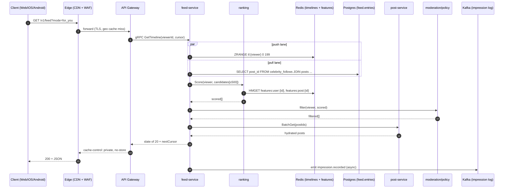
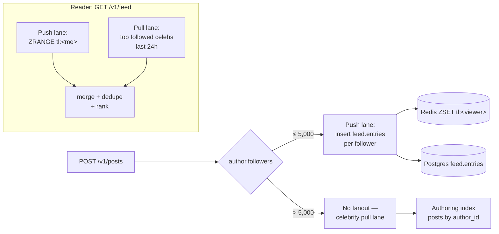
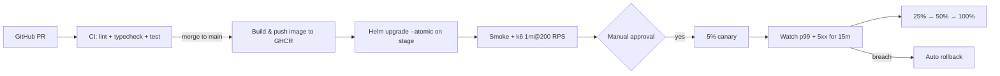

# Feed Pillar — Deep Dive

> Status: **Phase 1 implementation in progress.** This document is the canonical reference for the Feed pillar's architecture, ranking model, fanout strategy, performance budget, failure modes, and rollout plan. Companion to [`architecture.md`](./architecture.md).

The Feed pillar is the highest-leverage system in Ather: it is what makes the product feel alive, drives day-1 retention, and produces the engagement signals every other AI system feeds on. Everything in this document is geared to one number: **p99 of `GET /v1/feed` ≤ 100 ms.**

---

## 1. End-to-end request flow



### 1.1 Latency budget (p99, end-to-end ≤ 100 ms)

| Step | Budget | Notes |
|---|---|---|
| Edge + gateway | 5 ms | mTLS + JWT verify cached |
| Recall (ZSET + ANN + trending) | 20 ms | parallel; `Promise.all` |
| Score | 40 ms | LightGBM/Triton; fallback formula in `ranker.ts` |
| Policy filter | 5 ms | mute / block / age-gate / shadowban |
| Hydrate (post + author) | 15 ms | mget against Redis cache, Postgres on miss |
| Serialize + return | 5 ms | RSC streams first 5 cards |
| **Slack** | 10 ms | for jitter |

Every step has a circuit breaker: if its p99 exceeds 2× budget for 30 s, it is fenced out and we degrade gracefully (see §6).

---

## 2. Hybrid push/pull fanout



**Why this exact split?**
- Pushing to 200 followers is cheap; pushing to 200M (a celebrity) is a write storm and a hot-key disaster.
- Pulling from 5 normal creators is cheap; pulling from 5,000 is N+1.
- The 5k threshold is calibrated against the long-tail follower distribution: ~99.5% of authors are below it; the remaining 0.5% are amortized across all readers.

The pure logic that decides which lane to use lives in [`services/feed/src/fanout.ts`](../services/feed/src/fanout.ts) (`planFanout`, `mergeLanes`). Tests in [`services/feed/test/fanout.test.ts`](../services/feed/test/fanout.test.ts).

---

## 3. Ranking (the prompt formula, productionized)

```
Score(viewer, post) =
    0.40 * engagement_prob(post.metrics)
  + 0.30 * interest_affinity(viewer, post)
  + 0.15 * freshness(post, τ)
  + 0.10 * creator_quality(post.author)
  + 0.05 * diversity_term     ← applied during MMR re-rank
```

**Calibration:**
- `engagement_prob` is in [0, 1] from `(views, likes, comments, shares, watchTimeMs)`.
- `interest_affinity` is tag-Jaccard between `viewer.interests` and `post.tags` (v1); production replaces with `cosine(user_emb, post_emb)` when embeddings are warm.
- `freshness` = `exp(-age_hours / τ)`; `τ` derived from `post.kind` (reels: 6 h, posts: 24 h, long-form: 36 h).
- `creator_quality` = clipped-z `[-2, 2]` mapped to `[0, 1]`; gated authors → 0.
- `diversity_term` is the prompt's 5% slot; we apply it via MMR with `λ = 0.95` so a slate doesn't repeat creators or topics.

Implementation in [`services/feed/src/ranker.ts`](../services/feed/src/ranker.ts) is **the exact production fallback** — the online stack uses LightGBM v1 served by Triton, with this code as the offline fallback when inference is degraded. Unit tests cover every component, the weighted sum, and the MMR penalty (see [`services/feed/test/ranker.test.ts`](../services/feed/test/ranker.test.ts)).

### 3.1 Two-stage retrieval

1. **Recall** (≤ 20 ms, ~500 candidates total)
   - 60% from `tl:{viewer}` (push lane, ZRANGE).
   - 25% from ANN over `user_embedding` (Milvus, k=125).
   - 10% from `trending:{country}` ZSET (Redis).
   - 5% from "fresh from creators you just followed" (Postgres tail query).

2. **Score** (≤ 40 ms): the formula above.

3. **Policy filter** (≤ 5 ms): mute / block / shadowban / age-gate / NSFW gate / sponsored cap (≤1 in 8 slots).

4. **MMR re-rank** (≤ 5 ms): apply diversity penalty.

5. **Hydrate** (≤ 15 ms): `post-svc.batchGet(postIds)` with Redis cache.

### 3.2 Bias gate (mandatory, blocks model release)

Every model promotion runs sliced offline AUC across:

- Language (all 31 locales from `@ather/i18n`)
- Country
- Creator follower bucket (0–100, 100–10k, 10k–1M, 1M+)
- Estimated gender (where consented)
- Account age (< 30 d vs ≥ 30 d)

A release fails CI if **any slice's AUC drops > 2% vs. the aggregate.** No exceptions; revert and retrain.

---

## 4. Database

The full DDL is in [`infra/postgres/migrations/0001_feed_pillar.sql`](../infra/postgres/migrations/0001_feed_pillar.sql). Highlights:

| Table | Why | Hot index |
|---|---|---|
| `identity.users` | citext handle, hashed PII, status enum | `users_handle_unique`, `users_search_gin` |
| `social.follows` | two indexes — `(follower_id, followee_id)` PK and `(followee_id, created_at)` for fanout-on-read | `follows_followee_idx` |
| `content.posts` | partial indexes filter `WHERE deleted_at IS NULL` | `posts_author_created_idx` |
| `content.post_metrics` | hot counters separated from posts | `post_metrics_hot_idx (hot_score DESC)` |
| `feed.entries` | materialized timeline rows | `feed_entries_viewer_score_idx (viewer_id, score DESC, created_at DESC)` |
| `feed.user_signals` | durable seed for the ranker | PK on `user_id` |

`content.posts.embedding` is added in a guarded `DO` block — only when pgvector is installed, so the migration runs unmodified on environments that don't have it.

### 4.1 Sharding ladder

| Stage | Move |
|---|---|
| ≤ 10M users | Single Postgres primary + 2 read replicas. PgBouncer in front. |
| ≤ 100M | Add Aurora reader fleet; route `feed.entries` reads to readers; writes to primary. |
| 100M+ | Citus shard `content.posts`, `content.comments`, `feed.entries` by `hash(viewer_id)`. `social.follows` is two-way indexed and shards either way. |
| 500M+ | Cells: each cell = full stack for ~50M users; edge router pins users to home cell. |

---

## 5. Observability + SLOs

| Metric | Target | Alert |
|---|---|---|
| `feed_home_p99_ms` | ≤ 100 | page on > 200 ms for 5 min |
| `feed_home_5xx_rate` | ≤ 0.1% | page on > 0.5% for 5 min |
| `ranking_fallback_rate` | ≤ 1% | warn on > 5% for 10 min |
| `ranker_v1_auc_offline` | ≥ 0.78 | block model release |
| `feed_cache_hit_rate` | ≥ 90% | warn on < 80% |
| `cold_start_first_slate_ms` | ≤ 200 | warn on > 400 |

All metrics emitted via OpenTelemetry → Prometheus / Tempo / Loki via `service-kit`'s shared SDK. Dashboards: one **golden-signals** board per service plus a single product board (DAU, feed CTR, time-to-first-impression, tip success).

We do **not** alert on CPU/memory directly — only on user-impacting symptoms. HPA still scales on CPU.

---

## 6. Failure modes — all designed, none avoided

| Scenario | What breaks | Detection | Mitigation | Graceful degrade |
|---|---|---|---|---|
| Ranking pod 100% down | for_you slate empty | circuit breaker on `ranker.score` | fall back to `tl:{viewer}` chronological | tag response `ranker=fallback`; client shows "Showing latest" pill |
| Redis cache stampede on hot post | Postgres CPU spikes to 100% | `pg_stat_activity` long queries | request coalescing (singleflight per `postId`) + jittered TTL ±20% | comment counts marked "approx", served from Postgres |
| Kafka consumer lag > 30 s | counters stale, fanout delayed | lag alert | scale consumer group + replay from offset | UI shows "approx" pill; reconcile via daily Spark job |
| Region outage | half users offline | health-check failures + AWS event | DNS shift to other region within 60 s | cross-region read-only for affected cell |
| Viral spike (10× in 5 min) | hot post hammers Postgres | RPS alert | edge-cached post page (1 s SWR) + per-post Redis lane + write-behind comments | comments delayed up to 5 s with banner |
| 2G client | TTI fails | RUM | service worker shell + offline outbox + 64 KB image variants | offline-readable last 50 feed items |
| Bot follow wave | spam fanout to N users | per-IP token bucket + behavioral model | shadow-limit new accounts until score > τ | none (silent) |
| Postgres long migration | downtime risk | DDL audit | expand → backfill → contract; `pt-online-schema-change` style | feature-flagged paths |
| Embedding model regression | bad recall | offline AUC slice gate | block release; auto-rollback canary at 1% error | last-good model continues serving |

---

## 7. Security

- **Authn**: JWT verify in `service-kit` (already implemented; refresh-rotation + reuse-detection lives in monolith auth route).
- **Authz**: feed endpoints require `Bearer` token; viewers can only read their own timeline.
- **Rate limiting**: tiered limits via `service-kit/rate-limit`; bypassed in tests via `NODE_ENV==='test'`.
- **PII at rest**: `users.email_hash` / `phone_hash` are SHA-256 of normalized values; raw email/phone never written to Postgres in this schema.
- **Pod hardening**: `runAsNonRoot`, `readOnlyRootFilesystem`, all caps dropped, `automountServiceAccountToken: false`, `seccompProfile: RuntimeDefault`. See [`infra/k8s/feed-service.yaml`](../infra/k8s/feed-service.yaml).
- **Network**: `NetworkPolicy` allows ingress only from gateway pods, egress only to Postgres / Redis / Kafka / OTel / DNS.
- **Supply chain**: image is multi-arch + provenance via `docker/build-push-action` cached on GHA; intended to be cosigned in a future PR.

---

## 8. Deployment



The deploy workflow is at [`.github/workflows/deploy-feed.yml`](../.github/workflows/deploy-feed.yml). It's gated: the image is built and pushed on every merge to `main`, but the `helm upgrade` step only runs when the repo variable `DEPLOY_ENABLED == 'true'` and `KUBE_CONFIG_DATA` secret is set — so this file is safe to merge before any cluster exists.

### 8.1 AWS topology (target)

| Layer | AWS service |
|---|---|
| Compute | EKS multi-AZ (3 zones); node groups: `general` (Graviton), `realtime` (c7g, dedicated for WS), `gpu` (g5.xlarge for inference) |
| RDBMS | Aurora Postgres r7g cluster, multi-AZ, logical replication to Redshift Serverless |
| Cache | ElastiCache Redis cluster mode — separate clusters for cache / presence / streams |
| Stream | MSK (Kafka) with Glue schema registry |
| Search | OpenSearch Service |
| Vector | Self-managed Milvus on EKS, or Qdrant Cloud |
| Object | S3 + CloudFront, signed URLs, Lambda@Edge for image variants |
| Secrets | KMS envelope encryption; rotated annually |
| Observability | Managed Grafana + AMP; Tempo on EKS for traces |

---

## 9. Ethical guardrails (what we will not build)

These are codified here so future reviewers can point at this section to reject PRs:

- No autoplay-locks that can't be exited with one tap.
- No social-proof inflation ("★★★★ 99% loved this") unless mathematically true.
- No guilt notifications ("your friends posted X days ago — come back!").
- No streak-recovery purchases or any monetization tied to lost streaks.
- No "your AI twin posted while you slept" — every AI action requires a click.
- No engagement modeling that includes outrage proxy signals (rage-likes, hate-shares) as positive features.

The ranker formula in §3 has zero outrage signal by design.

---

## 10. Roll-out plan (4 PRs)

1. **This PR** — schema, ranker, fanout, pg adapter, deploy artifacts, docs.
2. **Wire**: monolith `/api/feed` proxies to `services/feed`; Redpanda + Milvus in dev compose; OTel SDK in `service-kit`.
3. **Real signals**: `social-graph` service emits `follow.created`; embedding worker writes `posts.embedding`; ranker reads from Feast/Redis features.
4. **Cutover**: k6 1k → 10k RPS in CI, chaos test (kill ranker → fallback verifies), KMS-wrapped email hash migration, archive deprecated service folders.

After Pillar 1 hits its done-criteria (p99 < 100 ms at 10k RPS, AUC ≥ 0.78, bias slices ≤ 2%), Pillar 2 (Messaging) follows the same template.
